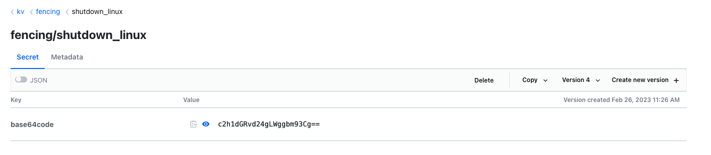

# Safecomet - Ransomware fencing and remediation system

## Description

Safecomet release hidden file sentinels across system. If any of them changes, starts fencing procedure.


## Agent

Comet Anget is written in Golang Below the most important things that agent does.

* Reads from Vault the association between nodes and path to be observed.
* If the path must be created, it creates a file with random content and store checksum in Vault.
* If the path already exists into the target system, the path is only put under observation.
* For each path the agent makes a check between the checksum stored in Vault and the checksum read in-place.
* If the checksum mimatch, the agent starts the fencing procedure. The speed of this operation is very important. The agent send to Vault that a fencing procedure has been started. The speed in this phase is very important, the timeout to Vault it will be very short. It is better start fencing quickly instead of wait too muuch time.

## OORT Panel

The oort panel is composed by multiple tool: Grafana, Prometheus and Hashicorp Vault

* (Ansible) Define the association between node name and observed path (Vault folder comets/<node_name>)

Example:
    webserver01:already_present:/data/mydb/myfile.db <checksum>
    webserver01:fencing_procedure:/data/mydb/myfile.db <fencing_procedure>

* (Ansible) Defines fencing procedure into the Vault folder "fencing"

Example:
    fencing/shutdown_linux => base64code: <base64 of shutdown command>
    fencing/shutdown_database_service => base64code: <base64 of database shutdown command>



## Comet Prometheus Exporter

The Comet Prometheus Exporter is an exporter located into the OORT Panel machine. It thakes topology and status of the distributed comets. Through this metrics Grafana can expose the OORT Panel Dashboard.

## High Availbility and support

For HA and support contact info@safecomet.com

## To Do

* HaProxy Configuration is not dynamic: pass backend through Ansible variables
* Add validation for HaProxy configuration file

```bash
    validate: haproxy -c -f %s
```
* Add handlers for reload containers after changes of their configuation files
* Add logging for HaProxy